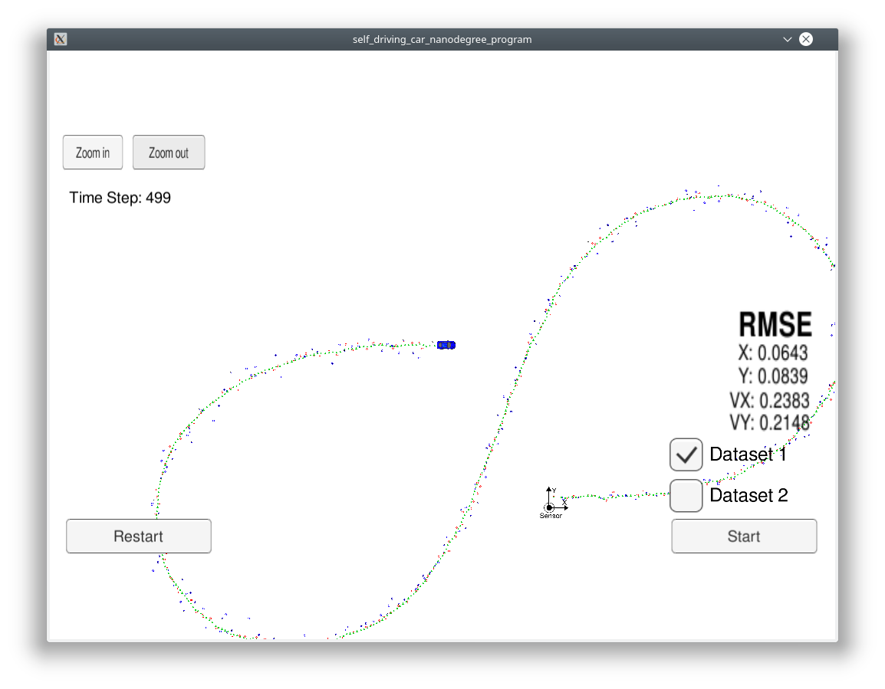
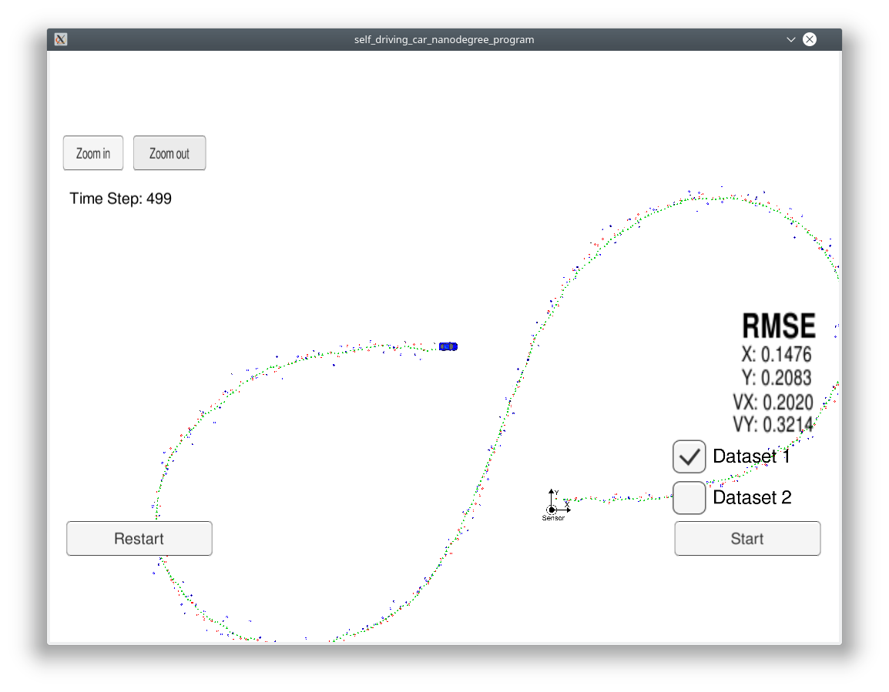
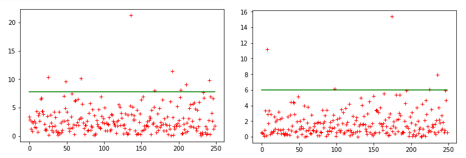
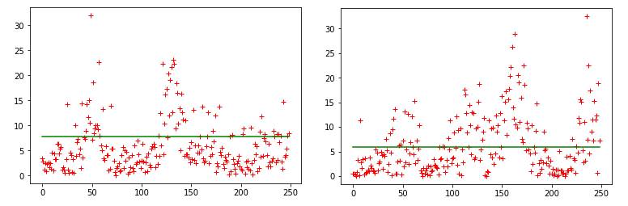

# Unscented Kalman Filter Project

# Summary

This project implements sensorfusion of radar and lidar sensor using an unscented kalman filter.

The steps of this project are the following:

- Implementation of the unscented kalman filter.
- Connection of the kalman filter with the simulator using websockets.
- Running the simulator and process the sensor data sent over the websockets.
- Tracking the object with position and velocity.
- Comparing the result with the ground truth as RSME.
- Checking the results with only one of the sensors used.
- Initialization of the sensor noise parameter with values from the vendor.
- Initialization of the process noise parameter with estimations
- Calculating the NIS value for different parameters to check if the noise estimation is plausible.

# The filter

## System

The system is modeled as CTRV (constant turn rate and velocity magnitude).

## Radar sensor

Measures position and velocity of the object in polar coordinates. The measurement function is not linear.

## Lidar sensor

Measures only the position of the object. The measurement function is linear.

# Implementation

## Classes

* `UKF`
  * is called by `main()` with new measurements
  * initializes the unscented kalman filter
  * calls the kalman filter for prediction and update steps
* `Logger`
  * logging as csv table
* `Measurement`
  * covariance matrix
  * `LidarMeasurement`
    * measurement matrix for kalman filter
  * `RadarMeasurement`
    * coordinate transformation polar <-> cartesian
    * jacobian for unscented kalman filter
* `Tools`
  * calculation of RMSE

## NIS analysis

Reads the log from the UKF and plots the NIS curve:

[analyse/nis_analyse.ipynb](analyse/nis_analyse.ipynb)

# Initialization

std_a: 0.8

std_yawdd: drives a bit less than 2 circles in 500 timesteps a 0.01s. So the yawdd = 4*pi/(500 * 0.01s) = 2.5
Set std_yawdd half = 1.2

Check -> best result with std_yawdd = 1.0

# Result

## Result with radar and lidar

## Result with lidar only

## Result with radar only

# NIS

std_a   | std_yawdd | RMSE x | y     | vx     | vy     | nis radar | nis lidar
--------|-----------|--------|-------|--------|--------|-----------|-----------
0.8     | 1.0       | 0.0626 | 0.0832| 0.1650 | 0.2151 | 0.036     | 0.020     
10.0    | 1.0       | 0.0843 | 0.1044| 0.5895 | 0.8717 | 0.044     | 0.036     
10.0    | 10.0      | 0.0907 | 0.1042| 0.8346 | 0.8443 | 0.028     | 0.016     
0.1     | 0.1       | 0.1255 | 0.1353| 0.2996 | 0.3152 | 0.124     | 0.137     
0.05    | 0.05      | 0.1255 | 0.1353| 0.2996 | 0.3152 | 0.253     | 0.373     

# Dependencies
* cmake >= 3.5
  * All OSes: [click here for installation instructions](https://cmake.org/install/)
* make >= 4.1 (Linux, Mac), 3.81 (Windows)
  * Linux: make is installed by default on most Linux distros
  * Mac: [install Xcode command line tools to get make](https://developer.apple.com/xcode/features/)
  * Windows: [Click here for installation instructions](http://gnuwin32.sourceforge.net/packages/make.htm)
* gcc/g++ >= 5.4
  * Linux: gcc / g++ is installed by default on most Linux distros
  * Mac: same deal as make - [install Xcode command line tools](https://developer.apple.com/xcode/features/)
  * Windows: recommend using [MinGW](http://www.mingw.org/)

## Basic Build Instructions

1. Clone this repo.
2. Make a build directory: `mkdir build && cd build`
3. Compile: `cmake .. && make`
4. Run it: `./UnscentedKF` Previous versions use i/o from text files.  The current state uses i/o
from the simulator.